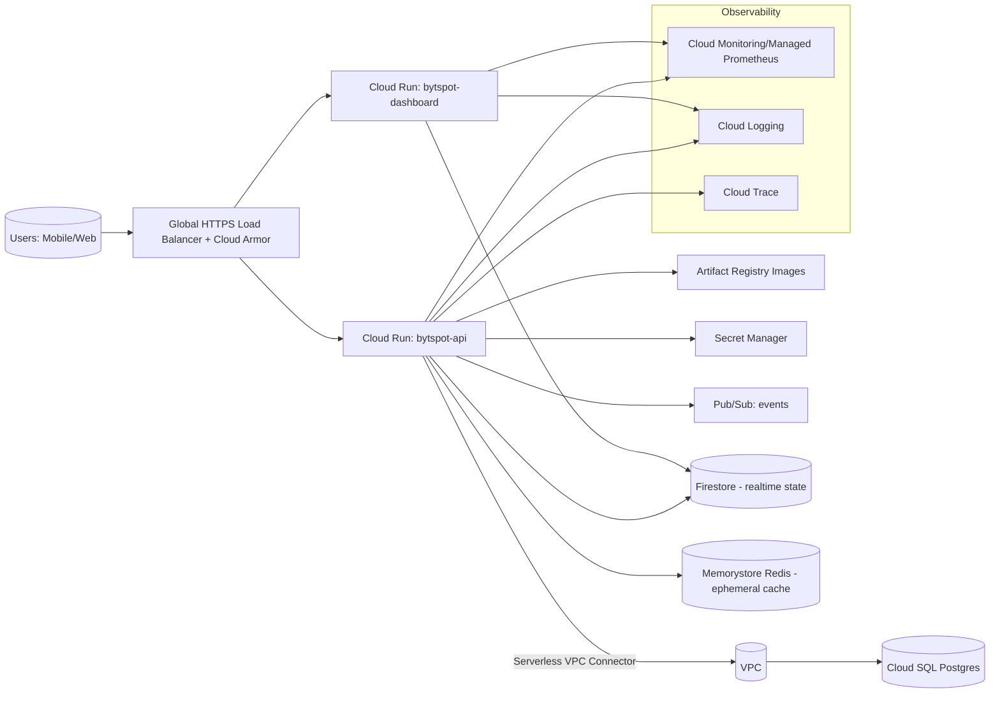

## Bytspot – GCP Production Architecture (Atlanta Beta)

Region: us-east1 (closest to Atlanta for low latency)

### High-level flow

### Service choices & justification
- Cloud Run (fully managed) over GKE for beta and spiky workloads:
  - Zero-to-peak autoscaling (incl. WebSockets/SSE), minimal ops, simple rollbacks and revisions.
  - GKE is excellent for complex multi-tenant, custom networking, or daemonsets, but adds cluster ops overhead.
- Cloud SQL (Postgres) for transactional consistency: bookings, payments, user data (ACID, referential integrity).
- Firestore (Native, nam5) for realtime fan-out to dashboards and presence/state streams with client listeners.
- Memorystore (Redis) for ephemeral cache, rate limits, sessions, and lock primitives.
- Artifact Registry for images; Secret Manager for credentials; Pub/Sub for eventing and async workflows.
- Global HTTPS LB + Cloud Armor for WAF, IP allow/deny, and path-based routing to multiple Cloud Run services.
- Cloud Monitoring/Logging/Trace + Managed Prometheus for metrics, logs, tracing. Grafana can read from Managed Prometheus.

### Environments
- Parameterized via Terraform variables (project_id, environment, region). Separate workspaces or tfvars for staging & prod.

### Notes for Atlanta beta
- Primary region: us-east1. Start single-region, single-SQL-primary (HA optional). Add multi-region DR and read replicas as load grows.

