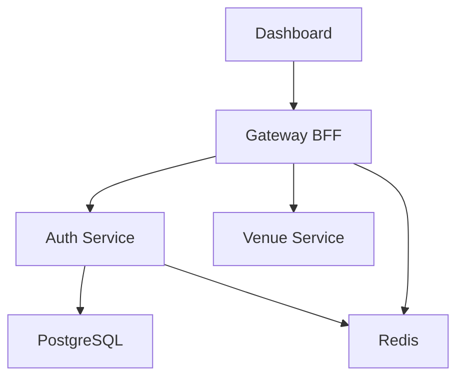

# Bytspot Microservices Migration

## Overview

This document outlines the migration from test services to the real Bytspot microservices architecture.

## Architecture Changes

### Before (Test Services)
```
services/
├── api/          # Simple Node.js test API
└── dashboard/    # Simple test dashboard
```

### After (Real Bytspot Microservices)
```
loc-byt/services/
├── auth-service/         # Go - JWT Authentication
├── venue-service/        # Go - Venue Discovery  
├── gateway-bff/          # Node.js - API Gateway
└── (dashboard from loc-byt/src/) # React - Frontend
```

## Services Deployed

| Service | Language | Port | Purpose | Cloud Run Service |
|---------|----------|------|---------|-------------------|
| **auth-service** | Go | 8080 | JWT Authentication | `bytspot-{env}-auth-service` |
| **venue-service** | Go | 8080 | Venue Discovery | `bytspot-{env}-venue-service` |
| **gateway-bff** | Node.js | 8080 | API Gateway & BFF | `bytspot-{env}-gateway-bff` |
| **dashboard** | React/Vite | 8080 | Frontend Web App | `bytspot-{env}-dashboard` |

## Infrastructure Updates

### Added Components
- **Redis (Memorystore)**: Caching and session management
- **JWT Secret Manager**: Secure authentication token storage
- **VPC Serverless Connector**: Network connectivity for Redis access

### Environment Variables
- `JWT_SECRET`: Secure JWT signing key from Secret Manager
- `REDIS_URL`: Redis connection string (when enabled)
- `DATABASE_URL`: PostgreSQL connection (auth-service only)
- `AUTH_SERVICE_URL`: Internal service communication
- `VENUE_SERVICE_URL`: Internal service communication

## CI/CD Pipeline Updates

### Build Process
Each service now has its own Dockerfile:
- `services/auth-service/Dockerfile` - Go multi-stage build
- `services/venue-service/Dockerfile` - Go multi-stage build  
- `services/gateway-bff/Dockerfile` - Node.js build
- `services/dashboard/Dockerfile` - React/Vite build with Nginx

### Deployment Process
1. **Build Phase**: All 4 services built in parallel
2. **Push Phase**: Images pushed to Artifact Registry
3. **Deploy Phase**: Services deployed to Cloud Run in dependency order

## Configuration Files Updated

### Terraform
- `infra/terraform/main.tf` - Added microservices resources
- `infra/terraform/variables.tf` - Added service image variables
- `infra/terraform/environments/*.tfvars` - Added microservices config

### GitHub Actions
- `.github/workflows/deploy-stg.yml` - Updated for microservices
- `.github/workflows/deploy-prod.yml` - Updated for microservices

## Service Communication



## Security Model

- **Auth Service**: Private, requires authentication
- **Venue Service**: Private, accessed via Gateway BFF
- **Gateway BFF**: Public API surface, handles authentication
- **Dashboard**: Public, serves static React app

## Next Steps

1. **Apply Terraform**: Deploy the new microservices infrastructure
2. **Run CI/CD**: Build and deploy the real services
3. **Test Services**: Verify all microservices are working
4. **Update DNS**: Point domains to the new services (optional)

## Rollback Plan

If issues occur, the old test services can be restored by:
1. Reverting the Terraform configuration
2. Reverting the CI/CD workflows
3. Redeploying the simple test services

## Monitoring

All services include health check endpoints:
- Auth Service: `GET /healthz`
- Venue Service: `GET /healthz`  
- Gateway BFF: `GET /healthz`
- Dashboard: `GET /` (nginx status)
