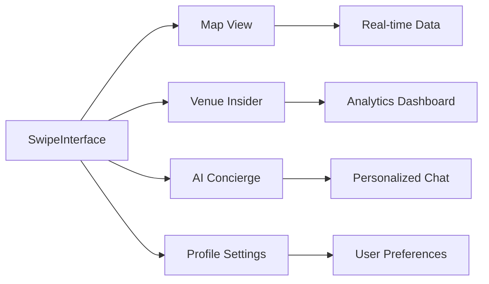

# Bytspot Design Template Roadmap Journey

A comprehensive design roadmap for Bytspot's location-based urban discovery platform, featuring glassmorphism aesthetics, real-time data visualization, and five core navigation sections.

## Core Application Architecture

### Navigation Structure (5-Section)
```
┌─────────────────────────────────────────┐
│                 HEADER                  │
│  Live Weather • Active Users • Location │
└─────────────────────────────────────────┘
│                                         │
│              MAIN CONTENT               │
│                                         │
┌─────────────────────────────────────────┐
│               FOOTER NAV                │
│ Discover│ Map │Insider│Concierge│Profile│
└─────────────────────────────────────────┘
```

## User Journey Flow

### Phase 1: Onboarding & Discovery (Code-aligned)
```
Landing Page → AuthModal (Sign In/Up toggle) → RegistrationFlow (permissions + preferences) → Main Browse Interface
```
(If needed, an "Address Search" preview can be shown in the main app's search bar.)

### Phase 2: Core Interaction (High-level)


## Design System Architecture

### Color Palette Foundation
```ts
// src/components/BytspotColors.ts (already present)
export const BytspotColors = {
  electricBlue: '#00BFFF',
  vibrantMagenta: '#FF00FF',
  midnight: '#121212',
  chillTeal: '#008080',
  energyOrange: '#FF4500',
};
```

### Glassmorphism Token
```css
/* Global token (proposed: src/styles/design-system.css) */
.glass-effect {
  backdrop-filter: blur(20px) saturate(180%);
  background: linear-gradient(135deg,
    rgba(255, 255, 255, 0.10) 0%,
    rgba(0, 191, 255, 0.08) 50%,
    rgba(255, 0, 255, 0.06) 100%);
  border: 1px solid rgba(255, 255, 255, 0.2);
  box-shadow:
    0 8px 32px rgba(0, 191, 255, 0.15),
    inset 0 1px 0 rgba(255, 255, 255, 0.2);
}
```

## Component Template Hierarchy (Proposed)

```
AppLayout/
├── Header/
│   ├── LiveIntelligenceHeader
│   ├── WeatherDisplay
│   ├── ActiveUsersCounter
│   └── LocationContext
├── MainContent/
│   ├── SwipeInterface
│   ├── MapInterface
│   ├── VenueInsider
│   ├── ConciergeChatEnhanced
│   └── ProfileSettings
└── FooterNavigation/
    ├── DiscoverButton
    ├── MapButton
    ├── InsiderButton
    ├── ConciergeButton
    └── ProfileButton
```

## Section-Specific Templates (JSX Sketches)

### Discover Section
```tsx
<DiscoverSection>
  <SearchFilters glassmorphism />
  <SwipeCardStack>
    {venues.map(v => (
      <VenueCard glassmorphism vibeEnergy={v.vibe} realTimeData={v.activity} />
    ))}
  </SwipeCardStack>
  <ActionButtons>
    <RejectButton />
    <SuperLikeButton />
    <LikeButton />
  </ActionButtons>
</DiscoverSection>
```

### Map Section
```tsx
<MapSection>
  <InteractiveMap>
    <TrendingHotspots animate="pulse" />
    <VenueMarkers realTime />
    <UserLocation />
    <ParkingAvailability />
  </InteractiveMap>
  <MapControls glassmorphism>
    <FilterToggle />
    <ViewModeSwitch />
    <LocationCenter />
  </MapControls>
</MapSection>
```

### Insider Section
```tsx
<InsiderSection>
  <VenueAnalytics>
    <CrowdLevelChart realTime />
    <PeakTimeIndicator />
    <VibeEnergyMeter />
  </VenueAnalytics>
  <InsiderContent>
    <ExpertReviews />
    <HiddenGems />
    <LocalSecrets />
  </InsiderContent>
</InsiderSection>
```

### Concierge Section
```tsx
<ConciergeSection>
  <ChatInterface glassmorphism>
    <MessageHistory />
    <TypingIndicator />
    <SmartSuggestions />
  </ChatInterface>
  <ConciergeActions>
    <QuickActions />
    <VenueRecommendations />
    <ItineraryPlanner />
  </ConciergeActions>
</ConciergeSection>
```

### Profile Section
```tsx
<ProfileSection>
  <UserHeader glassmorphism>
    <Avatar />
    <UserStats />
    <MembershipLevel />
  </UserHeader>
  <PreferencesPanel>
    <VibePreferences />
    <LocationSettings />
    <NotificationControls />
  </PreferencesPanel>
  <AchievementShowcase />
</ProfileSection>
```

## Real-Time Features (Data Shapes)
```ts
export type VenueActivity = {
  crowdLevel: 'low' | 'moderate' | 'high' | 'peak'
  vibeEnergy: number // 0..1
  waitTime: string
  trending: boolean
  peakTime: string
}

export type WeatherIntel = {
  condition: 'clear' | 'cloudy' | 'rain' | 'snow'
  temperature: number
  recommendation: string
  impact: 'positive' | 'neutral' | 'negative'
}

export type ActiveMetrics = {
  usersNearby: number
  trendingSpots: string[]
  hotZones: string[]
}
```

## Animation & Interaction

### Micro Interactions (CSS)
```css
.venue-card-swipe {
  transform: translateX(var(--swipe-distance));
  rotate: calc(var(--swipe-distance) * 0.1deg);
  opacity: calc(1 - abs(var(--swipe-distance)) / 300);
  transition: all 0.2s cubic-bezier(0.4, 0, 0.2, 1);
}
.interactive-button:active { transform: scale(0.96); filter: brightness(0.9); }
.content-loading { animation: shimmer 2s infinite; }
```

### Page Transitions (Framer Motion)
```tsx
<AnimatePresence mode="wait">
  {currentSection === 'discover' && (
    <motion.div initial={{ opacity: 0, x: 300 }} animate={{ opacity: 1, x: 0 }} exit={{ opacity: 0, x: -300 }} transition={{ type: 'spring', stiffness: 300, damping: 30 }}>
      <DiscoverSection />
    </motion.div>
  )}
</AnimatePresence>
```

## Map Menu Slide Up Feature (Implemented)

- Component: `src/components/MapMenuSlideUp.tsx`
- Purpose: Bottom sheet with 6 primary map actions + quick actions
- Integrates with existing `EnhancedFooter` via `onOpenMap`

```tsx
<MapMenuSlideUp open={open} onOpenChange={setOpen} onSelect={(a) => { /* navigate or toast */ }} />
```

Actions:
- Trending Hotspots (LIVE)
- Live Venue Data
- Smart Parking
- AI Navigation (PRO)
- Spot Radar
- Traffic Intelligence

## Implementation Phases (10 weeks)

### Phase 1: Foundation (Week 1-2)
- [ ] Core design system tokens and CSS
- [ ] Glassmorphism primitives/components
- [ ] Base navigation structure (header/main/footer)
- [ ] Time-based theme system scaffolding

### Phase 2: Core Features (Week 3-4)
- [ ] Swipe interface interactions
- [ ] Map integration with real-time stubs
- [ ] Venue detail modules
- [ ] Preference system and filters

### Phase 3: Intelligence Layer (Week 5-6)
- [ ] Recommendation engine hooks
- [ ] Smart notifications (sonner) patterns
- [ ] Venue analytics surfaces
- [ ] Contextual assistance hooks

### Phase 4: Advanced Features (Week 7-8)
- [ ] Analytics dashboard
- [ ] Group decisions
- [ ] Achievements
- [ ] Premium gates

### Phase 5: Polish & Optimization (Week 9-10)
- [ ] Performance budgets & audits
- [ ] Motion polish
- [ ] Accessibility (WCAG) checks
- [ ] Mobile-first refinement

## QA Checklist (Excerpt)
- [ ] Glassmorphism consistency
- [ ] Palette and typography adherence
- [ ] 60fps interactions on target devices
- [ ] Accessible labels, focus, and contrast

## Success Metrics (Excerpt)
- Session > 8 min, Interaction > 70%, Return > 60%
- Load < 2s, FPS > 55, Error < 1%, Crash < 0.1%

---

### Notes
- Uses existing shadcn/ui primitives (Sheet) and lucide-react icons.
- Color constants live in `src/components/BytspotColors.ts` and can power CSS tokens.
- Next step: integrate `MapMenuSlideUp` in the page that renders `EnhancedFooter` by wiring its `onOpenMap` to set open=true.

